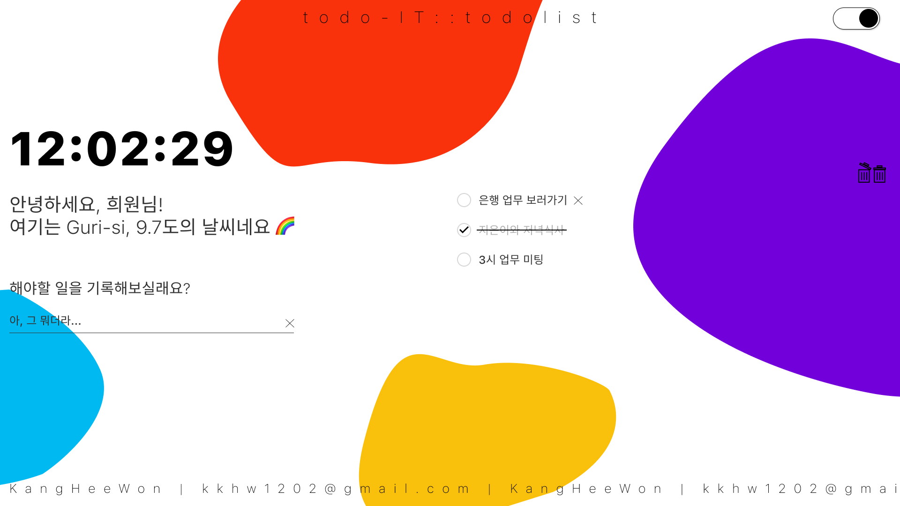

# todolist TODO-IT
by kang heewon 
✅ [노마드코더의 바닐라 JS로 크롬 앱 만들기](https://nomadcoders.co/javascript-for-beginners)를 공부하면서 추가로 응용해서 만들었어요!  
> 누구나 손쉽게 이용할 수 있는 TODO-LIST ! 💨 

---
 

## What kind of function is it? (ongoing)
- todo list를 사용하고자 하는 사용자의 이름을 기억해요. 
- 사용자가 입력했던 todo list를 기억해요. 
- 해야할 일을 삭제할 수 있어요. 
- 사용자의 위치를 파악해 위치와 날씨를 알려줘요. 
- 일반모드 & 다크모드의 콜라보! 
- 반응형으로 제작했어요. 